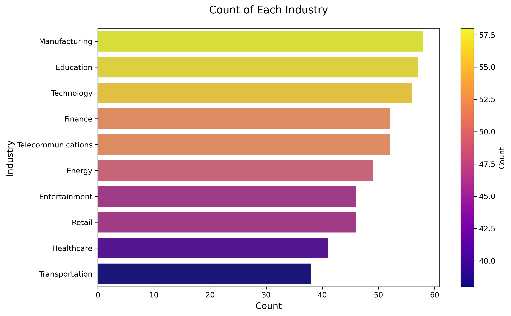

# AI Job Market Analysis

Author: Niranjan  
Date: 26 April 2025

---

# Project Background

This project explores the AI job market, focusing on global hiring trends, salary distributions, remote work patterns, and skills in demand. As a Data Analyst working within the AI and tech employment sector, the goal was to provide actionable insights that can support strategic hiring, career planning, and workforce development initiatives.

Insights and recommendations are provided on the following key areas:

- **Industry Trends**
- **Skill Requirements**
- **Geographic and Remote Work Patterns**
- **Automation Risk and Future Growth**

The Python notebooks used to inspect, clean, and analyze the data can be found here `AI_CareerScopeipynb`.  
An executive presentation summarizing the results can be found here `AI Career Scope Documentation.pdf` 
An interactive visualization dashboard will be added shortly 

---

# Data Structure & Initial Checks

The project's dataset, `ai_job_data.csv`, was sourced from Kaggle and includes over 15,000 AI job listings globally. The primary data fields are as follows:
- **Job Title**: Role designation for each listing
- **Industry**: Sector classification of the employer
- **Required Skills**: Key technical competencies demanded
- **Salary Range**: Compensation details (annual)
- **Work Type**: Categorized as Remote, Hybrid, or Onsite
- **Company Size**: Employee headcount classification
- **Location**: City and country of the job
- **Automation Risk**: Estimate of how easily the role could be automated
- **Growth Projections**: Future outlook for the role category

---

# Executive Summary

### Overview of Findings

The analysis highlights that remote AI jobs offer approximately 20% higher salaries compared to onsite roles. Healthcare AI and Financial Technology (FinTech) sectors are emerging as leaders in AI adoption and hiring. Additionally, geographic hotspots such as San Francisco, Bangalore, and London continue to dominate the AI employment landscape. Specialized AI roles show robust future growth potential, while certain entry-level jobs face increased automation risk.

---

# Insights Deep Dive

### Industry Trends:

* **Healthcare AI and FinTech** lead in the number of AI job postings.
* **Manufacturing and Education** sectors are gradually increasing their AI workforce integration.
* Industries investing heavily in AI innovation are offering significantly higher average salaries.

### Skill Requirements:

* **Top Skills**: Machine Learning, Python programming, Deep Learning, Natural Language Processing.
* Demand for interdisciplinary AI expertise (e.g., AI + Domain Knowledge) is growing.
* Soft skills like project management and communication are increasingly valued in AI job descriptions.

### Geographic and Remote Work Patterns:

* **Highest Demand Cities**: San Francisco, Bangalore, London.
* Remote roles are not only higher-paying but are becoming increasingly standard across industries.
* Emerging AI job markets are appearing in second-tier tech cities globally.

### Automation Risk and Future Growth:

* Entry-level data processing jobs show high automation risk (>60%).
* Roles such as AI Research Scientists and AI Product Managers have very low automation risk and strong projected growth.
* Upskilling into AI-specialized fields greatly enhances job security and career progression.

---

# Recommendations

Based on the analysis above, the following actions are recommended:

* Focus learning efforts on AI specializations like Computer Vision, NLP, and AI Strategy to maximize career resilience and salary potential.
* Employers should prioritize flexible remote-first work environments to attract a broader, high-caliber AI talent pool.
* Workforce planners should establish structured upskilling programs to transition employees from high-risk roles to resilient AI positions.
* Policymakers should support AI education initiatives and reskilling programs to prepare the workforce for emerging AI-driven industries.

---

# Assumptions and Caveats

Several assumptions were made to address data limitations:

* Missing salary values were excluded rather than imputed, as they represented less than 5% of the dataset.
* Some job postings had incomplete skill listings; analyses on skill demand only included complete entries.
* Automation risk estimates were based on third-party machine learning models, introducing potential bias.
* Remote classification was standardized manually where ambiguous descriptions were provided.

